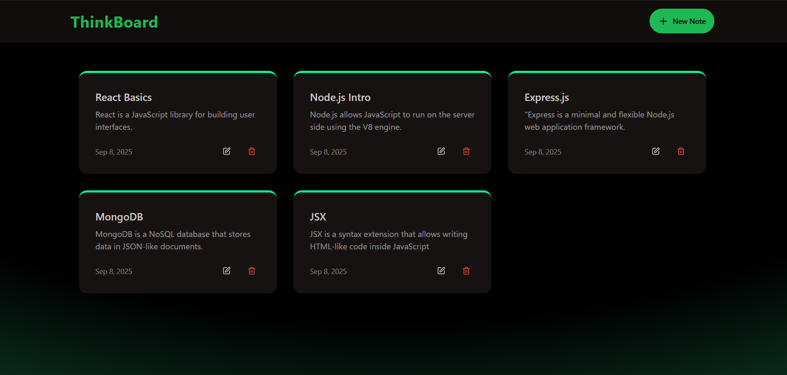
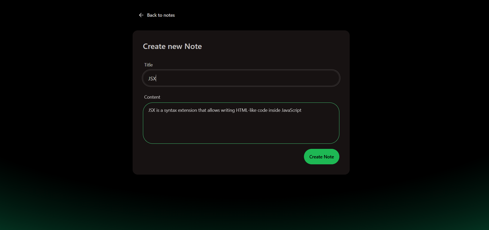
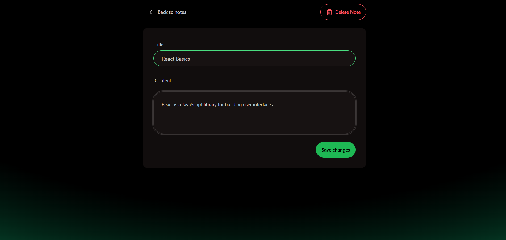

### MERN Stack Todo app

this is my todo full stack website where anyone can read write store and update their notes.

- <h1> Home Page</h1>

   

- <h1> new note page</h1>

   

- <h1> note update page</h1>

   

- <h1> Rate limit page</h1>

     

### Folder structure

```

Backend/
├── src/
│   ├── server.js
│   └── routes/
│       └── notesRoutes.js
├── package.json
├── node_modules/

```

A complete frontend and backend mern stack project.

### Backend

```
Rate limiting  : upstash
```
