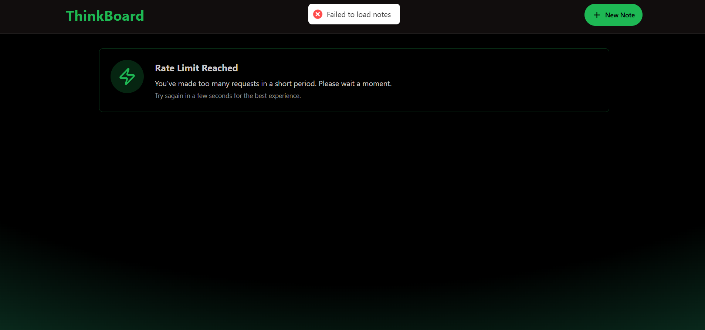

### MERN Stack Todo app

- <h1> Home Page</h1>

   

- <h1> new note page</h1>

   

- <h1> note update page</h1>

   

- <h1> Rate limit page</h1>

     

### Folder structure

```

Backend/
├── src/
│   ├── server.js
│   └── routes/
│       └── notesRoutes.js
├── package.json
├── node_modules/

```

A complete frontend and backend mern stack project.

### Backend

```
MONGO_URI=<your_mongo_uri>

UPSTASH_REDIS_REST_URL=<your_redis_rest_url>
UPSTASH_REDIS_REST_TOKEN=<your_redis_rest_token>

NODE_ENV=development

```
